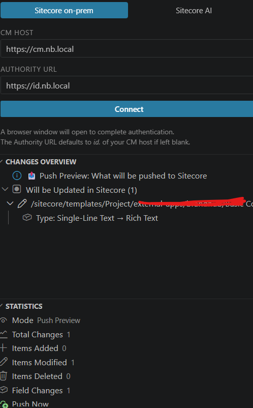
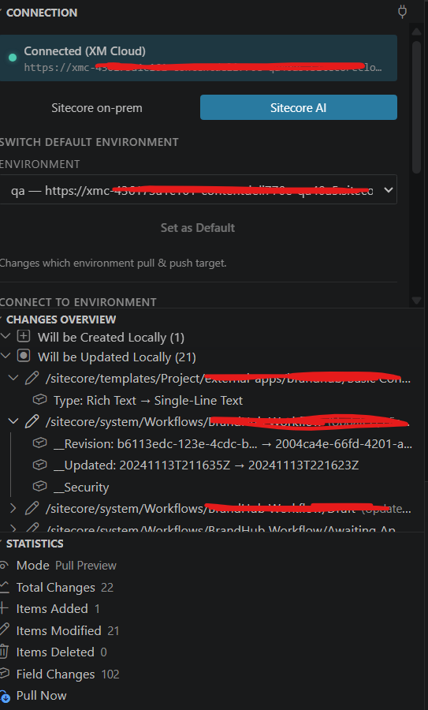

# Sitecore Serialization Viewer

A VS Code extension for visualizing Sitecore CLI serialization changes with field-level diffs, pull/push previews, validation, and built-in connection management — supporting both **Sitecore on-prem** and **Sitecore AI (XM Cloud)**.


---

## Features

###  Connection Management

Supports two connection modes selectable from the **Connection** panel:

| Mode | Use For |
|------|---------|
| **Sitecore on-prem** | Self-hosted XM / XP instances using Sitecore Identity Server |
| **Sitecore AI** | Sitecore XM Cloud (cloud-managed environments) |

- Auto-detects existing CLI connections on startup by scanning `.sitecore/user.json`
- Connection state persisted per workspace
- Connected host URL displayed in the status card after authentication

###  Pull Preview & Pull Now
- Runs `dotnet sitecore ser pull --what-if` to preview what Sitecore has changed **before touching any files**
- Displays a Create / Update / Delete breakdown in the sidebar with field-level details
- After reviewing, click **Pull Now** to execute the real pull — a confirmation dialog prevents accidental overwrites
- **Pull Now** is available in three places: the Statistics panel, the Changes Overview toolbar, and the notification toast

CLI commands executed:
```bash
# Preview
dotnet sitecore ser pull --what-if

# Execute (after confirmation)
dotnet sitecore ser pull
```

###  Push Preview & Push Now
- Runs `dotnet sitecore ser push --what-if` to preview what your local files would push to Sitecore **before making any changes**
- Displays a Create / Update / Delete breakdown in the sidebar with field-level details
- After reviewing, click **Push Now** to execute the real push — a confirmation dialog prevents accidental overwrites
- **Push Now** is available in three places: the Statistics panel, the Changes Overview toolbar, and the notification toast

CLI commands executed:
```bash
# Preview
dotnet sitecore ser push --what-if

# Execute (after confirmation)
dotnet sitecore ser push
```

###  Serialization Validation
- Runs `dotnet sitecore ser validate` and groups results into **Errors / Warnings / Info**
- Each issue shows the Sitecore item path and message
- If errors are found, a **Fix Validations** button appears (`dotnet sitecore ser validate --fix`)

###  Statistics
- Total change counts by type (Added / Modified / Deleted)
- Field-level change metrics
- Mode indicator (Local Changes / Pull Preview / Push Preview / Validation)
- Clickable action items (Pull Now / Push Now / Fix Validations) directly in the stats panel

###  Field-Level Diffs
- Side-by-side diff viewer for individual fields
- Field metadata (ID, scope, language, version)
- Inline preview of old vs new values
- Shared and language-specific field support

###  Tree Views
- **Changes Overview** — organized by change type, expandable to field level
- **Statistics** — counts and action buttons
- **Connection** — manage your Sitecore connection

---

## Installation

### From VSIX
1. Download the latest `.vsix` file from the [Marketplace app page](https://marketplace.visualstudio.com/items?itemName=JagadheeshMaroju.sitecore-serialization-viewer)
2. In VS Code open the Extensions view (`Ctrl+Shift+X`)
3. Click the `...` menu  **Install from VSIX…**
4. Select the downloaded file

The extension activates automatically when it detects a `*.module.json` file in the workspace.

---

## Getting Started

### 1. Connect to Sitecore

Open the **Sitecore Serialization** activity bar  **Connection** panel, then choose your mode.

---

#### Sitecore on-prem (Sitecore Identity Server)



1. Select **Sitecore on-prem**
2. Enter your **CM Host** (e.g. `https://cm.your-site.com`)
3. The **Authority URL** is auto-suggested as `https://id.your-site.com` — change it if your Identity Server is at a different URL
4. Click **Connect** — a browser window opens for authentication

CLI command executed:
```bash
dotnet sitecore login --authority https://id.your-site.com --cm https://cm.your-site.com --allow-write true
```

After a successful connection the status card shows the connected CM host URL.

---

#### Sitecore AI (XM Cloud)



The **Sitecore AI** panel has three sub-sections:

---

##### Switch Default Environment

Populated automatically from your `.sitecore/user.json` endpoints. All environments that reference the XM Cloud base configuration are listed here (e.g. `default`, `qa`, `staging`).

- The **current default** environment is pre-selected in the dropdown
- **Set as Default** is disabled while the current default is selected — it enables as soon as you pick a different environment
- Clicking **Set as Default** runs:

```bash
dotnet sitecore environment set-default -n <EnvironmentName>
```

> Pull and push operations always run against the **default** environment, so switching here changes what `ser pull` / `ser push` targets.

---

##### Connect to Environment

Use this to add a new XM Cloud environment to your project by its environment ID (found in the XM Cloud Deploy portal).

1. Paste the **Environment ID** (e.g. `xxxxxxxx-xxxx-xxxx-xxxx-xxxxxxxxxxxx`)
2. Click **Connect**

CLI command executed:
```bash
dotnet sitecore cloud environment connect --environment-id <EnvironmentId> --allow-write true
```

After connecting, the new environment appears in the **Switch Default Environment** dropdown automatically.

---

##### Cloud Login

Use this once to authenticate your machine with Sitecore Cloud (or when your session expires).

1. Click **Cloud Login**
2. A browser window opens for Sitecore Cloud authentication

CLI command executed:
```bash
dotnet sitecore cloud login
```

---

> After any Sitecore AI action (login, connect to environment, set default) the status card refreshes and shows the currently active CM host read from `.sitecore/user.json`.

---

### 2. Preview Pull / Push

Use the toolbar buttons in the **Changes Overview** panel:

| Button | Action |
|--------|--------|
| `$(cloud-download)` Preview Pull | Runs `dotnet sitecore ser pull --what-if` and shows what will change |
| `$(cloud-upload)` Preview Push | Runs `dotnet sitecore ser push --what-if` and shows what will change |

The preview shows every affected item broken down by change type:

| Icon | Type | Meaning |
|------|------|---------|
| `+` Create | Item exists in Sitecore but not locally | Will be created locally on pull |
| `~` Update | Item exists in both but has differences | Changed fields will be shown with old  new values |
| `-` Delete | Item exists locally but not in Sitecore | Will be removed locally on pull |

Expand any item in the tree to see exactly which fields changed and what the old and new values are.

---

### 3. Pull Now / Push Now

After a preview, a **Pull Now** or **Push Now** button becomes available in three places:

| Location | How to trigger |
|----------|----------------|
| **Statistics** panel | Click the **Pull Now** / **Push Now** action item |
| **Changes Overview** toolbar | Click the toolbar button that appears after a preview |
| **Notification toast** | Click **Pull Now** / **Push Now** in the notification that appears |

Both actions show a **confirmation dialog** before running. Dismissing the dialog cancels the operation without making any changes.

CLI commands executed:
```bash
# Real pull — overwrites local files with Sitecore content
dotnet sitecore ser pull

# Real push — writes local files to Sitecore
dotnet sitecore ser push
```

> For Sitecore AI, pull and push always target the **default environment** set in `.sitecore/user.json`. Use **Switch Default Environment** in the Connection panel to change the target before running.

---

### 3. Validate Serialization

Click the `$(check-all)` **Validate** toolbar button in the **Changes Overview** panel.

- Runs `dotnet sitecore ser validate`
- Groups issues into **Errors**, **Warnings**, and **Info**
- Each issue shows the Sitecore path and description

If errors are found:
- A **Fix Validations** button (`$(wrench)`) appears in the toolbar and Statistics panel
- The notification toast offers **Fix Validations**
- Clicking it runs `dotnet sitecore ser validate --fix` (with confirmation)

---

## Commands

All commands are available via the Command Palette (`Ctrl+Shift+P`  type `Sitecore`):

| Command | Description |
|---------|-------------|
| `Sitecore: Connect to Sitecore` | Focus the Connection panel |
| `Sitecore: View Serialization Changes` | Re-run local Git analysis |
| `Sitecore: Preview Pull Changes` | What-if pull from Sitecore |
| `Sitecore: Preview Push Changes` | What-if push to Sitecore |
| `Sitecore: Pull Now` | Execute real pull (with confirmation) |
| `Sitecore: Push Now` | Execute real push (with confirmation) |
| `Sitecore: Validate Serialization` | Run `dotnet sitecore ser validate` |
| `Sitecore: Fix Validation Errors` | Run `dotnet sitecore ser validate --fix` |
| `Sitecore: Refresh Serialization View` | Refresh local change analysis |
| `Sitecore: Show Item Details` | Open rich detail panel for a tree item |

---

## Configuration

| Setting | Default | Description |
|---------|---------|-------------|
| `sitecoreSerializer.loginType` | `"identity"` | `"identity"` for Sitecore on-prem, `"cloud"` for Sitecore AI |
| `sitecoreSerializer.sitecoreHost` | `""` | CM host URL saved after a successful on-prem connection |
| `sitecoreSerializer.sitecoreAuthority` | `""` | Identity Server URL saved after a successful on-prem connection |
| `sitecoreSerializer.serializationPath` | `"Serialization"` | Path to the serialization folder (relative to workspace root) |
| `sitecoreSerializer.autoRefresh` | `true` | Refresh automatically when `.yml` files change |
| `sitecoreSerializer.showFieldIDs` | `false` | Show field GUIDs alongside field names |

---

## Requirements

- VS Code 1.85.0 or higher
- [Sitecore CLI](https://doc.sitecore.com/xmc/en/developers/xm-cloud/sitecore-command-line-interface.html) (`dotnet tool install -g Sitecore.CLI`)
- A Sitecore XM / XM Cloud project with CLI serialization (`.module.json` files)

---

## How It Works

1. **Activation** — triggers when a `*.module.json` is found in the workspace
2. **Auto-detection** — scans `.sitecore/user.json` for an existing CM host and available environments
3. **YAML parsing** — reads Sitecore item YAML to extract field values
4. **CLI integration** — delegates pull / push / validate / login / environment management to the `dotnet sitecore` CLI via `child_process`

### `.sitecore/user.json` — Environment Resolution

For Sitecore AI, the extension reads your project's `.sitecore/user.json` to discover environments. Endpoints that contain a `ref` field are treated as XM Cloud environments:

```json
{
  "endpoints": {
    "xmCloud": {
      "host": "https://xmclouddeploy-api.sitecorecloud.io/",
      "authority": "https://auth.sitecorecloud.io/"
    },
    "default": {
      "ref": "xmCloud",
      "host": "https://xmc-<id>-dev.sitecorecloud.io/",
      "allowWrite": true
    },
    "qa": {
      "ref": "xmCloud",
      "host": "https://xmc-<id>-qa.sitecorecloud.io/",
      "allowWrite": true
    }
  },
  "defaultEndpoint": "default"
}
```

The `defaultEndpoint` value determines which environment `ser pull` and `ser push` operate against. Use **Switch Default Environment** in the Connection panel to change it.

---

## Known Issues

- Field name resolution uses a built-in GUID map; custom fields fall back to their GUID
- Large repositories (1000+ items) may have a slight initial load delay
- Binary field values are not visualised in diffs

---

## License

MIT — see [LICENSE](LICENSE) for details.

---

